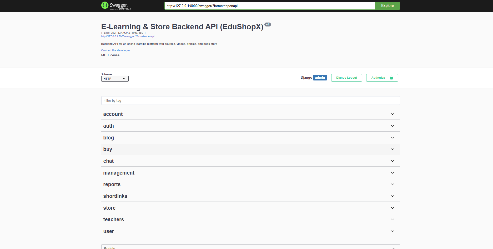
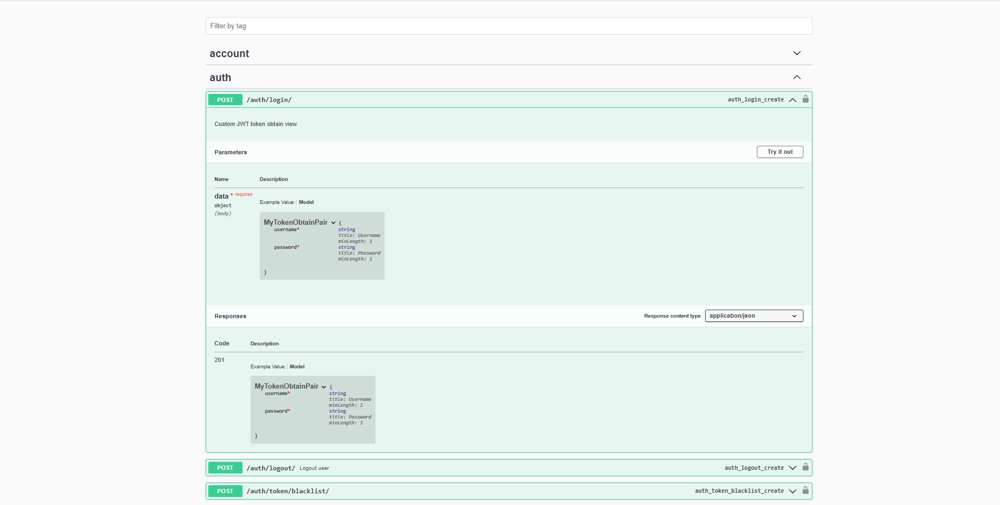
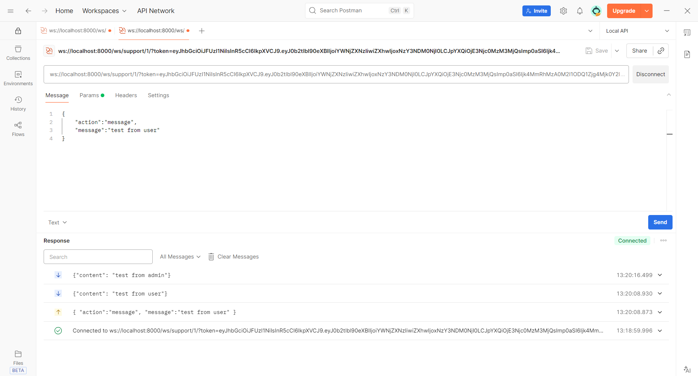
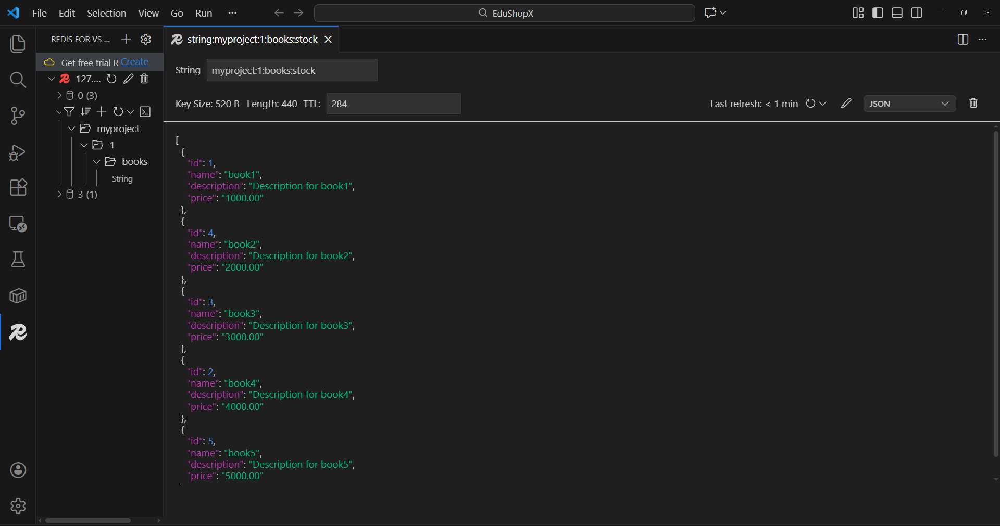

# Overview

**EduShopX** is a scalable backend system for an educational e-commerce platform, built with **Django Rest Framework**
featuring asynchronous background processing with **Celery**, caching and message brokering via **Redis**
real-time communication using **Django Channels**, and a fully containerized setup using **Docker**.

---

## Key Features

- **Role-based system** with **Student**, **Teacher**, and **Admin** roles
- **RESTful API** built using **Django Rest Framework**
- **Caching layer** powered by **Redis** to improve performance of frequently accessed endpoints
- **Asynchronous background tasks** using **Celery + Redis** (e.g. reports, emails, heavy operations)
- **Real-time communication** implemented with **Django Channels** (chat & messaging features)
- **JWT-based authentication** with token refresh, verify, and blacklist support
- **Dockerized architecture** for easy local development and deployment


---

## Screenshots

### Swagger API Documentation



### Real-time Chat (Django Channels tested via Postman)


### Cashing (Redis)



---


## Project Setup (Docker)

Follow the steps below to run the project locally using Docker:

### 1. Clone the repository
```bash
git clone https://github.com/hosein-hasani-5898/EduShopX.git
```
```bash
cd EduShopX
```

### 2. Create environment variables and redis.conf

Create a .env.dev file and set the required environment variables as per the .env.exaple file.

cp redis.conf.example redis.conf and Set your Redis password in redis.conf before running Docker.

### 3. Build and run with Docker Compose
```bash
docker-compose up --build
```

### 4. Apply migrations (automatically)

Migrations are applied automatically when the Django container starts.


### 5. Access the application

Django API: http://127.0.0.1:8000/api/

Swagger Docs: http://127.0.0.1:8000/swagger/

Admin Panel: http://127.0.0.1:8000/admin/

All services (Django, Redis, Celery) will be up and running via Docker.
